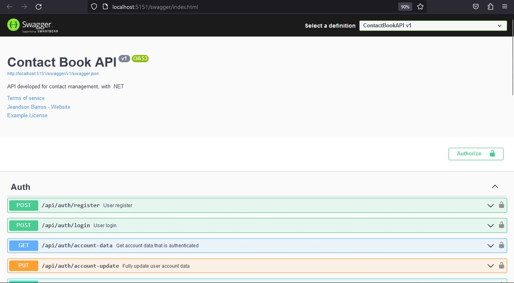
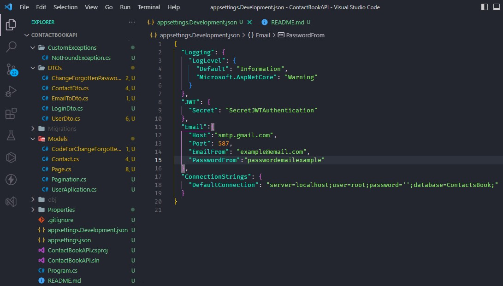

  
  
  
  

# API Contact Book System with .NET

API developed for contact management. The API has the following functionality:
- Authentication
- Sending email to reset forgotten password
- Management of contacts
- Documentation with Swagger

## Packages used in the project
- Microsoft.EntityFrameworkCore.Design 
- Microsoft.AspNetCore.Identity.EntityFrameworkCore 
- Microsoft.AspNetCore.Authentication.JwtBearer 
- Pomelo.EntityFrameworkCore.MySql 

## Execution
Before running the API, you need to complete the following step:

### Install Core Entity Framework Tools
Core Entity Framework Tools for the .NET Command Line Interface. You only need to install it once on the machine,
if you have already installed it, you don't need to run this command:
`dotnet tool install --global dotnet-ef` 

### App Settings
Now you need to pass the appsettings.Development.json file,
the necessary settings for the database, jwt token and email.

- JWTToken config: 
  `"JWT": {
    "Secret": "SecretJWTAuthentication"
},`
 

- Email config: 
  `"Email":{
    "Host":"smtp.gmail.com",
    "Port": 587,
    "EmailFrom": "example@email.com",
    "PasswordFrom":"passwordemailexample"
},`

- Data Base MySql config: 
  `"ConnectionStrings": {
    "DefaultConnection": "server=localhost;user=root;password='';database=ContactBook;"
    }`

The appsettings.Development.json file should look like this:

### Data Base migration and update
The following commands are used to prepare the configurations of the
tables in the database and execute the configurations accordingly:

`dotnet-ef migrations add CreateTables` 
`dotnet ef database update`

### Comand to run project
Command to run the project If all the previous steps were successfully executed,
just run the following command in the console to run the project: 
`dotnet watch run`
